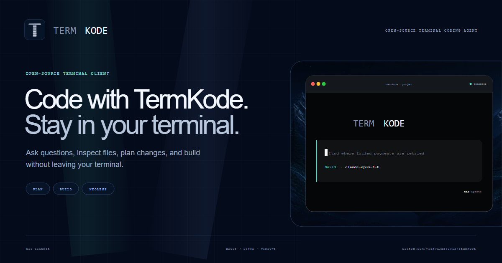

<p align="center">
  
</p>

<p align="center">
  <a href="#install">Install</a>
  ·
  <a href="#connect-a-model">Connect a model</a>
  ·
  <a href="#what-the-agent-can-do">Tools</a>
  ·
  <a href="#approvals-and-checkpoints">Approvals</a>
  ·
  <a href="#scripting">Scripting</a>
  ·
  <a href="./docs/DEVELOPMENT.md">Development</a>
  ·
  <a href="./CONTRIBUTING.md">Contributing</a>
</p>

# TermKode

TermKode is an open-source coding agent that lives in your terminal. It reads and
edits your code, runs commands, searches the web, and answers questions about the
machine it is running on — without pulling you out of the shell.

**It is yours end to end.** No account, no sign-in, no credits, no telemetry.
TermKode runs entirely on your computer and talks to AI providers with your own
API key. Point it at a local model and it never touches the network at all.

```sh
cd path/to/project
termkode
```

## Why it is different

- **Nothing runs behind your back.** Every write and every shell command is
  shown for approval first, and a checkpoint is taken before each file is
  touched, so `/rewind` puts it back.
- **No account system.** Nothing to sign up for. Nothing phones home.
- **Your key, your bill.** Seventeen providers, or a local model for free.
- **Local models are first class.** Ollama, LM Studio, llama.cpp, vLLM, and Jan
  are detected automatically — no key, no configuration, no internet.
- **Model lists are live.** New models appear in `/models` the day the provider
  ships them, because TermKode asks the provider instead of shipping a list.
- **Sessions are plain files.** Every conversation is JSON under
  `~/.termkode/sessions`. Read them, back them up, delete them.
- **One process.** The CLI runs its own API in-process. Nothing to deploy, no
  port to open, no database to provision.

## Install

### Standalone binary

Download the build for your platform from
[Releases](https://github.com/vishvajeet2012/TermKode/releases). The binary embeds its
runtime, so nothing else needs to be installed.

### macOS and Linux

```sh
curl -fsSL https://raw.githubusercontent.com/vishvajeet2012/TermKode/main/install.sh | sh
```

Alpine Linux needs the C++ runtime first:

```sh
apk add --no-cache libstdc++ libgcc
```

### Windows

```powershell
irm https://raw.githubusercontent.com/vishvajeet2012/TermKode/main/install.ps1 | iex
```

### Homebrew

```sh
brew install termkode/tap/termkode
```

Verify the install:

```sh
termkode --version
```

Binaries are unsigned today, so macOS may ask for approval in Privacy &
Security and Windows may show a SmartScreen warning. Published SHA-256 checksums
and GitHub attestations can be used to verify each download.

## Connect a model

Start TermKode and run:

```text
/providers
```

Pick a provider, paste its API key, choose a model. The key is checked against
the provider before it is saved to `~/.termkode/config.json`, which is readable
only by your user. Switch models any time with `/models`.

| Provider | Environment variable | Get a key |
| --- | --- | --- |
| Claude (Anthropic) | `ANTHROPIC_API_KEY` | https://console.anthropic.com/settings/keys |
| ChatGPT (OpenAI) | `OPENAI_API_KEY` | https://platform.openai.com/api-keys |
| DeepSeek | `DEEPSEEK_API_KEY` | https://platform.deepseek.com/api_keys |
| Qwen (Alibaba) | `QWEN_API_KEY` | https://bailian.console.alibabacloud.com |
| Kimi (Moonshot) | `KIMI_API_KEY` | https://platform.moonshot.ai/console/api-keys |
| MiniMax | `MINIMAX_API_KEY` | https://platform.minimax.io |
| Grok (xAI) | `XAI_API_KEY` | https://console.x.ai |
| NVIDIA NIM | `NVIDIA_API_KEY` | https://build.nvidia.com |
| Llama (Meta) | `LLAMA_API_KEY` | https://llama.developer.meta.com |
| Groq | `GROQ_API_KEY` | https://console.groq.com/keys |
| OpenRouter | `OPENROUTER_API_KEY` | https://openrouter.ai/keys |
| Mistral | `MISTRAL_API_KEY` | https://console.mistral.ai/api-keys |
| Cerebras | `CEREBRAS_API_KEY` | https://cloud.cerebras.ai |
| Together AI | `TOGETHER_API_KEY` | https://api.together.ai/settings/api-keys |
| GLM (Z.ai) | `ZAI_API_KEY` | https://z.ai/manage-apikey/apikey-list |
| Cloudflare (Workers AI) | `CLOUDFLARE_API_TOKEN` | https://dash.cloudflare.com/profile/api-tokens |
| **Local AI** | none | detected automatically |

Environment variables are read from the shell, a project `.env`, or
`~/.termkode/.env`. They are handy for CI; `/providers` is easier day to day.

Cloudflare is reached through an account-scoped URL, so it asks for a
`CLOUDFLARE_ACCOUNT_ID` as well as a token — `/providers` prompts for both, and
the id is the one in your dashboard URL after `/accounts/`. Its catalogue lives
on a different endpoint from the chat API, so TermKode reads it from there and
lists only text-generation models. Pick one Cloudflare documents as
function-calling capable, such as `@cf/openai/gpt-oss-120b` or
`@cf/meta/llama-3.3-70b-instruct-fp8-fast`: a model that cannot call tools
cannot read your files or run your tests.

### Local models

If Ollama, LM Studio, llama.cpp, vLLM, Jan, or Text generation WebUI is running,
TermKode finds it on its usual loopback port and lists its models under **Local
AI**. No key, no setup, and nothing leaves the machine. For a server on an
unusual port:

```sh
LOCAL_AI_BASE_URL=http://127.0.0.1:9000/v1 termkode
```

Small local models (under about 4B parameters) can call tools but often pick the
wrong one or give up after a failure. For real agent work, use a larger local
model or a hosted provider.

## Using it

| Command | What it does |
| --- | --- |
| `/new` | Start a fresh conversation |
| `/sessions` | Reopen a past conversation with its full history |
| `/providers` | Connect a provider and add its API key |
| `/models` | Switch models across every connected provider |
| `/agents` | Switch between PLAN and BUILD |
| `/init` | Write an `AGENTS.md` describing this project |
| `/commit` | Stage and commit the current work |
| `/compact` | Summarize the older turns to free up context |
| `/rewind` | Undo file changes back to a checkpoint |
| `/permissions` | Review and remove what the agent is allowed to run |
| `/think` | Turn extended thinking on or off |
| `/lens` | Explore the repository and replay agent activity |
| `/mcp` | Inspect configured MCP servers and their tools |
| `/theme` | Change the color theme |
| `/exit` | Quit |

Press `tab` to flip between **PLAN** (read-only investigation) and **BUILD**
(full write access). `esc` interrupts a reply. `@` completes file paths in the
prompt. Start in a chosen mode with `--plan` or `--build`; `termkode --help`
lists every flag.

Extended thinking is **off by default**: on small models it consumes the whole
response budget before the model ever calls a tool. Turn it on with `/think`
when you want deliberation over speed.

## What the agent can do

| Tool | Purpose | Mode |
| --- | --- | --- |
| `readFile` | Read a file | PLAN + BUILD |
| `listDirectory` | List a directory | PLAN + BUILD |
| `glob` | Find files by pattern | PLAN + BUILD |
| `grep` | Search file contents | PLAN + BUILD |
| `readPdf` | Extract the text of a PDF | PLAN + BUILD |
| `fetchUrl` | Fetch a page or API response as text | PLAN + BUILD |
| `webSearch` | Search the web, no API key needed | PLAN + BUILD |
| `todoWrite` | Track a task list through multi-step work | PLAN + BUILD |
| `writeFile` | Create or overwrite a file | BUILD |
| `editFile` | Replace one unique string in a file | BUILD |
| `multiEdit` | Many edits across files, all-or-nothing | BUILD |
| `bash` | Run a command in the real shell | BUILD |
| `bashOutput` | Read new output from a background command | BUILD |
| `killBash` | Stop a background command | BUILD |

BUILD tools ask before they run - see [Approvals and
checkpoints](#approvals-and-checkpoints).

File tools stay inside the project directory. `bash` does not: it is a real
shell with your permissions, which is what lets TermKode answer questions about
memory, disk, processes, and installed software. It knows which OS and shell it
is on and writes commands to match.

An agent that keeps calling tools would otherwise keep going forever, so one
message is allowed **40 tool calls** before it stops and hands the turn back.
Raise or lower it with `--max-steps`.

### Commands that do not exit

A dev server, a watcher, or a long build never returns, so waiting for it in the
foreground only burns the timeout. `bash` takes a `background` flag for those: it
starts the command, returns an id immediately, and keeps collecting output.

```text
bash    { command: "bun run dev:cli", background: true }  →  bg_1
bashOutput { id: "bg_1", filter: "error|listening" }      →  what it printed since the last read
killBash   { id: "bg_1" }                                 →  stopped, with its final output
```

`bashOutput` returns only what is new since you last read it, so a log can be
polled without re-reading it, and `filter` narrows a noisy one to the lines that
matter. Starting a background command needs approval like any other shell
command - the prompt says it keeps running - but reading its output and stopping
it do not, because the process is one TermKode itself started.

Anything still running is shown in the prompt as `N running`, and everything is
stopped when TermKode exits, so a dev server never outlives the terminal that
started it.

## Approvals and checkpoints

Read-only tools run freely. Everything that writes a file or runs a shell
command stops and asks:

```text
Permission needed
bash
bun test packages/cli

  Yes, run it once                          y
  Yes, and always allow bash:bun test       a
  No, tell the agent to stop                n / esc
  No, and never allow bash:bun test         d
```

"Always allow" stores a rule in `~/.termkode/permissions.json`, which survives
restarts and is listed by `/permissions`:

| Rule | Matches |
| --- | --- |
| `writeFile` | every call to that tool |
| `bash:git status` | bash commands starting with that prefix |

A rule only covers a command it fully accounts for, so `bash:git status` will
not quietly allow `git status && rm -rf .`.

Commands that delete recursively, discard git history, pipe a download into a
shell, escalate privileges, or touch files outside the project are marked
**dangerous**. They are asked every time and can never become an always-allow
rule. `--yolo` (or `--dangerously-skip-permissions`) skips every prompt, and
the prompt line says `no approvals` while it is on. An explicit deny rule still
holds.

Before the agent writes a file, TermKode copies it. `/rewind` lists those
checkpoints and restores one, undoing everything written after it - including
deleting files the agent created. It is per file rather than a `git stash`, so
it works in a directory that is not a repository and never touches your index,
stash list, or history.

Every edit also reports its diff, so changes are shown as `+`/`-` lines in the
transcript instead of being announced after the fact.

MCP tools are governed separately, by the per-tool policies in
`.termkode/mcp.json` described below.

## Context

A coding session fills a context window far faster than a chat does - one
search over a large repository can outweigh every message before it. At 80% of
the model's window TermKode summarizes the older turns into a written handoff -
goal, decisions, files changed, findings, commands run, what is still open -
and keeps the recent turns verbatim. The conversation continues instead of
failing on a provider error.

Run `/compact` to do it early, before a long stretch of work.

## Project instructions

An `AGENTS.md` at the root of the project is loaded into the system prompt on
every request. It is where a repository states the things a model cannot guess:
its commands, its layout, its conventions, and the mistakes that are easy to
make in it.

```sh
/init
```

`/init` explores the repository and writes the file for you. `TERMKODE.md` and
`CLAUDE.md` are read as well, `~/.termkode/AGENTS.md` applies to every project,
and in a monorepo the file nearest the working directory has the last word.

## Custom commands

A markdown file in `.termkode/commands` becomes a slash command, so the prompts
a team reuses live in the repository instead of in whoever remembered to paste
them.

```markdown
---
description: Review a change against our API guidelines
---
Review $ARGUMENTS against docs/api-guidelines.md. Report only real violations.
```

Saved as `.termkode/commands/review.md`, that is `/review src/routes/user.ts`.
`$ARGUMENTS` is replaced with whatever was typed after the command name; without
the placeholder the text is appended. Files in `~/.termkode/commands` follow you
between projects, and a project command of the same name wins.

## Hooks

Some rules should hold whether or not the model felt like following them. A hook
is a command the project owns, configured in `.termkode/hooks.json`:

```sh
cp .termkode/hooks.example.json .termkode/hooks.json
```

| Event | When it runs | What it can do |
| --- | --- | --- |
| `sessionStart` | A conversation opens | Adds context to the first message |
| `userPromptSubmit` | Before a message is sent | Adds context to that message |
| `preToolUse` | Before a tool runs | **Exit code 2 blocks the call** |
| `postToolUse` | After a tool runs | Formats, lints, reports back |

Each hook gets the call as JSON on stdin and `TERMKODE_TOOL_NAME`,
`TERMKODE_HOOK_EVENT`, and `TERMKODE_SESSION_ID` in its environment. `matcher` is
a regular expression tested against the tool name; leave it out to match every
tool. Anything a hook prints is handed to the model. A hook that fails for its
own reasons is reported and ignored - only exit code 2 is a decision about the
tool call.

## Scripting

`-p` answers one prompt and exits, which is what makes TermKode usable from a
script, a git hook, or CI:

```sh
termkode -p "what does the retry logic in packages/server do?"
cat build.log | termkode -p "explain this failure"
termkode -p "list every TODO with its file" --json
```

Piped stdin becomes context. `--json` prints the answer, the tool calls, and
token usage as one object. The exit code is `0` on success, `2` when a tool call
was refused, and `1` when the run itself failed.

There is nobody to approve a tool call in a headless run, so a write or a shell
command fails unless a stored rule already allows it. Use `--mode PLAN` for
read-only work, allow what you trust with `/permissions`, or pass `--yolo`.

Each run is saved as a session, so `/sessions` reopens it in the terminal UI.

## MCP servers

TermKode reads `.termkode/mcp.json` from the active project and hands those
tools to the model alongside its own — this is how capabilities like browser
automation get added.

```sh
mkdir -p .termkode
cp .termkode/mcp.example.json .termkode/mcp.json
```

Every MCP tool is denied until it has an explicit policy:

| Policy | Availability |
| --- | --- |
| `read` | PLAN and BUILD |
| `write` | BUILD only |
| `disabled` | Never |

`"*"` sets a default for a server's remaining tools, though per-tool policies
are clearer. Secrets use environment references such as `${env:GITHUB_TOKEN}`;
resolved values stay in the server process and are never returned by the
inspection API. Both stdio and streamable HTTP transports are supported, and
clients are closed as soon as a response finishes.

## NeoLens

NeoLens is the built-in code explorer, opened with `/lens` or `ctrl+l`:

- **Graph** — TypeScript dependency relationships, highlighting files the agent
  touched.
- **Workspace** — read-only, line-numbered previews with capped filename and
  content search.
- **Timeline** — replays tool activity with changed files, failures, model runs,
  tokens, elapsed time, and estimated cost.

It is project-scoped and everything stays local. It respects `.gitignore`, never
follows symlinks, hides common credential files, rejects paths outside the
project, and caps its work so large repositories stay responsive.

## Where your data lives

| Path | Contents |
| --- | --- |
| `~/.termkode/config.json` | Provider keys and the selected model |
| `~/.termkode/permissions.json` | Tools and commands you chose to always allow |
| `~/.termkode/sessions/` | One JSON file per conversation |
| `~/.termkode/checkpoints/` | File snapshots taken before each write |
| `~/.termkode/todos/` | Task lists, per project |
| `~/.termkode/AGENTS.md` | Your instructions, for every project |
| `~/.termkode/commands/` | Your slash commands, for every project |
| `AGENTS.md` | Instructions for the current project |
| `.termkode/mcp.json` | MCP servers for the current project |
| `.termkode/hooks.json` | Commands to run around tool calls |
| `.termkode/commands/` | Slash commands for the current project |

Set `TERMKODE_HOME` to keep all of it somewhere else.

## Repository layout

| Path | Purpose |
| --- | --- |
| `packages/cli` | Terminal UI and the `termkode` command |
| `packages/server` | The API the CLI runs in-process: chat, sessions, providers, MCP, NeoLens |
| `packages/shared` | Provider catalog, tool contracts, shared schemas |
| `packages/web` | Landing page |
| `scripts` | Release, packaging, and smoke-test scripts |
| `docs` | Development and release guides |

## Development

Requires [Bun](https://bun.sh) 1.3.13.

```sh
bun install --frozen-lockfile
bun run dev:cli
```

That is the whole loop — the CLI starts the API in its own process. Run the
landing page with `bun run dev:web`, and the full quality gate with
`bun run check` (lint, typecheck, tests, web build).

See the [development guide](./docs/DEVELOPMENT.md) for details, and
[CONTRIBUTING.md](./CONTRIBUTING.md) before opening a pull request.

## License

[MIT](./LICENSE)
